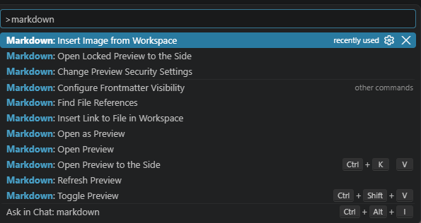

# The Syntax of Markdown

## 1. Editing Markdown Files in Visual Studio Code

Press `F1` or `Ctrl + Shift + P` to open the **Command Palette**, then choose the Markdown command you need.



---

## 2. Text Formatting

### Headings

Markdown supports up to six levels of headings. The more `#` characters you use, the smaller the heading becomes.

```markdown
# H1

## H2

### H3

#### H4

##### H5

###### H6
```

# H1

## H2

### H3

#### H4

##### H5

###### H6

### Text Styles

Markdown supports several text styles.

```markdown
Normal text

**Bold text**

__Bold text__

*Italic text*

_Italic text_

***Bold and italic text***

___Bold and italic text___

~~Strikethrough~~

<mark>Highlighted text</mark>

x<sup>2</sup>

H<sub>2</sub>O
```

Normal text

**Bold text**

**Bold text**

*Italic text*

*Italic text*

***Bold and italic text***

***Bold and italic text***

~~Strikethrough~~

<mark>Highlighted text</mark>

x<sup>2</sup>

H<sub>2</sub>O

> Note: `<mark>`, `<sup>`, and `<sub>` are HTML tags rather than standard Markdown syntax, but they are supported by many Markdown renderers.

---

## 3. Quotes and Code

### Blockquotes

Use `>` to create a blockquote.

```markdown
> This is a quote.
```

> This is a quote.

You can create nested blockquotes by adding more `>` characters.

```markdown
> First level
>> Second level
>>> Third level
```

> First level
>
> > Second level
> >
> > > Third level

### Inline Code

Use backticks to display code or other monospace text inline.

```markdown
This is `let s = 0;`
```

This is `let s = 0;`

### Code Blocks

Use triple backticks to create a code block.

You can specify the programming language after the opening backticks to enable syntax highlighting.

````markdown
```js
let a = 1;
```
````

```js
let a = 1;
```

For example, you can use `js`, `csharp`, `python`, `html`, `css`, `json`, and many other language identifiers.

---

## 4. Links and Images

### Links

The basic syntax for a Markdown link is:

```markdown
[Link text](https://google.com)
```

[Link text](https://google.com)

You can also display a URL directly:

```markdown
<https://google.com>
```

https://google.com

### Images

The basic syntax for an image is:

```markdown

```


The text inside `[]` is called the **alt text**. It describes the image when the image cannot be displayed.

---

## 5. Horizontal Lines

You can create a horizontal line using three or more hyphens, underscores, or asterisks.

```markdown
---

___

***
```

---

---

---

---

## 6. Lists and Tables

### Ordered Lists

Use numbers followed by a period.

```markdown
1. Item 1
2. Item 2
3. Item 3
```

1. Item 1
2. Item 2
3. Item 3

You can also use `1.` for every item. Markdown will automatically number them.

```markdown
1. Item 1
1. Item 2
1. Item 3
```

### Unordered Lists

Use `-`, `+`, or `*` to create an unordered list.

```markdown
- Item 1
- Item 2
- Item 3
```

* Item 1
* Item 2
* Item 3

### Nested Lists

Indent the nested items to create a hierarchy.

```markdown
- Item 1
- Item 2
- Item 3
  - Item 3-1
    1. Item
    2. Item
  - Item 3-2
```

* Item 1
* Item 2
* Item 3

  * Item 3-1

    1. Item
    2. Item
  * Item 3-2

### Tables

Use `|` to separate columns and `---` to separate the header from the table body.

```markdown
| Col 1 | Col 2 |
| --- | --- |
| This | is |
| an | example |
| table | with |
| two | columns |
```

| Col 1 | Col 2   |
| ----- | ------- |
| This  | is      |
| an    | example |
| table | with    |
| two   | columns |

You can also control the alignment of each column:

```markdown
| Left | Center | Right |
| :--- | :---: | ---: |
| A | B | C |
| D | E | F |
```

| Left | Center | Right |
| :--- | :----: | ----: |
| A    |    B   |     C |
| D    |    E   |     F |

---

## 7. Task Lists

Use `[ ]` for an unchecked task and `[x]` for a completed task.

```markdown
- [ ] Task not completed
- [x] Task completed
```

* [ ] Task not completed
* [x] Task completed
